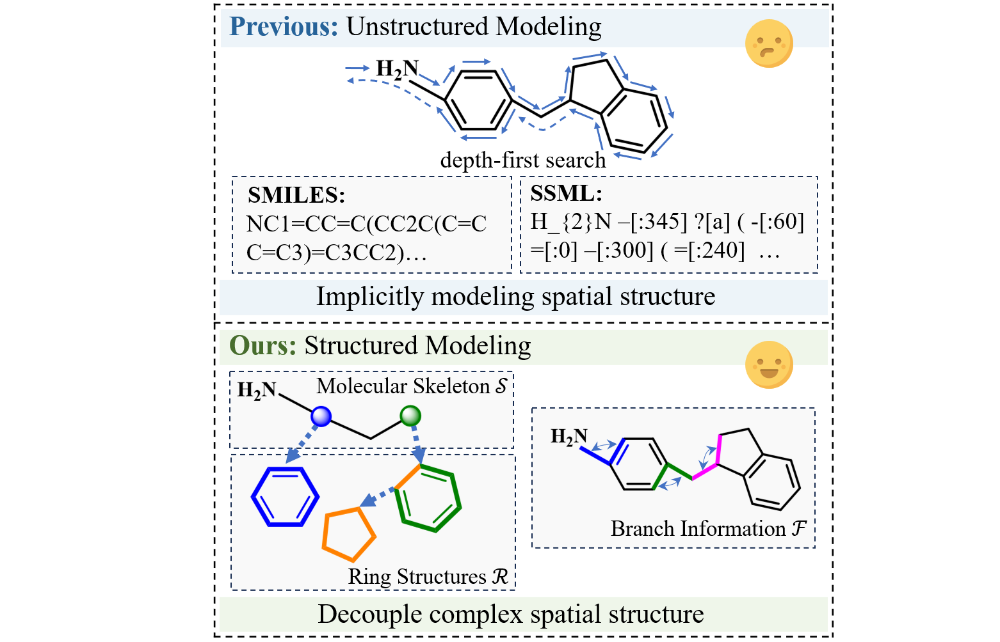
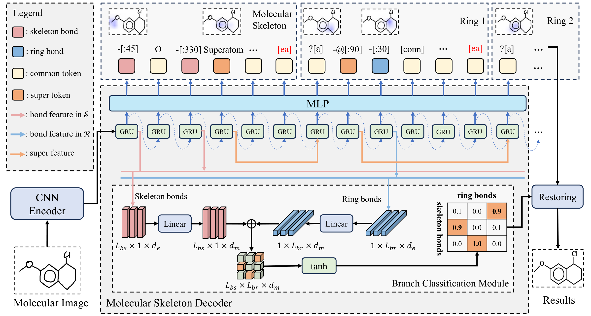
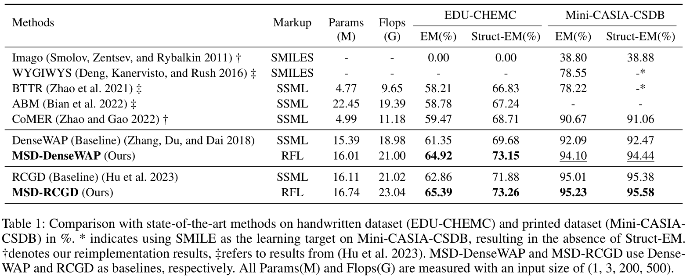
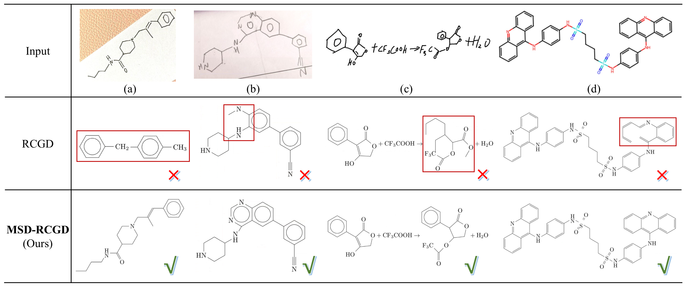

# :fire: RFL: Simplifying Chemical Structure Recognition with Ring-Free Language :fire:

This is the official implementation of RFL: Simplifying Chemical Structure Recognition with Ring-Free Language

## :star: Overview 
Comparasion of RFL with previous modeling language: 


Model Architecture:



## :balloon: Datasets

- [EDU-CHEMC](https://github.com/iFLYTEK-CV/EDU-CHEMC) : A dataset for handwritten chemical structure recognition.
- [Mini-CASIA-CSDB](https://nlpr.ia.ac.cn/databases/CASIA-CSDB/index.html) : A dataset for printed chemical structure recognition.

## :memo: Ring-Free Language
Our Ring-Free Language (RFL) utilizes a divide-and-conquer strategy to describe chemical structures in a hierarchical form. For a molecular structure $G$, it will be equivalently converted into a molecular skeleton $S$, individual ring structures $R$ and branch information $F$.

You can use the following command to generate Ring-Free Language of single samples. We have provided some typical examples for testing in `./RFL_/RFL.py`:
```bash
cd RFL_
python RFL.py
```

Batch generation of multiple process:
```bash
cd RFL_
bash RFL_gen.sh
```


## :bulb: Training
You can start training using the following command:

```bash
bash train.sh
```

Note: The dataset path and related paramaters need to be modified in `rain\config.py`


## :airplane: Evalutation
```bash
bash test_organic.sh
```


## :rocket: Results
Experiments Result:


Case Study:



