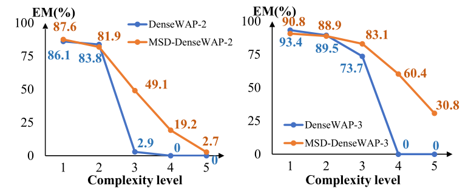

# :fire: RFL: Simplifying Chemical Structure Recognition with Ring-Free Language :fire:

This is the official implementation of our paper: "RFL: Simplifying Chemical Structure Recognition with Ring-Free Language". Accepted by AAAI 2025.

## :fire: News:

TODO:
- [ ] Update paper link in arxiv.
- [ ] Update Source Code.
- [ ] Add a simple demo. 


## :star: Overview 

The primary objective of Optical Chemical Structure Recognition is to identify chemical structure images into corresponding markup sequences. However, the complex two-dimensional structures of molecules, particularly those with rings and multiple branches, present significant challenges for current end-to-end methods to learn one-dimensional markup directly. To overcome this limitation, we propose a novel Ring-Free Language (RFL), which utilizes a divide-and-conquer strategy to describe chemical structures in a hierarchical form. RFL allows complex molecular structures to be decomposed into multiple parts, ensuring both uniqueness and conciseness while enhancing readability. This approach significantly reduces the learning difficulty for recognition models. Leveraging RFL, we propose a universal Molecular Skeleton Decoder (MSD), which comprises a skeleton generation module that progressively predicts the molecular skeleton and individual rings, along with a branch classification module for predicting branch information. Experimental results demonstrate that the proposed RFL and MSD can be applied to various mainstream methods, achieving superior performance compared to state-of-the-art approaches in both printed and handwritten scenarios.

Comparasion of RFL with previous modeling language: 
<div align="center">

</div>

Our Model Architecture:
<div align="center">

</div>


## :balloon: Datasets

In Our paper, we use two dataset as follows.
- [EDU-CHEMC](https://github.com/iFLYTEK-CV/EDU-CHEMC) : A dataset for handwritten chemical structure recognition.
- [Mini-CASIA-CSDB](https://nlpr.ia.ac.cn/databases/CASIA-CSDB/index.html) : A dataset for printed chemical structure recognition.

## :memo: Ring-Free Language
Our Ring-Free Language (RFL) utilizes a divide-and-conquer strategy to describe chemical structures in a hierarchical form. For a molecular structure $G$, it will be equivalently converted into a molecular skeleton $S$, individual ring structures $R$ and branch information $F$.

You can use the following command to generate Ring-Free Language of single samples. We have provided some typical examples for testing in `./RFL_/RFL.py`:
```bash
cd RFL_
python RFL.py
```

Batch generation of multiple process using mutli-processings:
```bash
cd RFL_
bash RFL_gen.sh
```


## :bulb: Training
You can start training using the following command:

```bash
bash train.sh
```

Note: The dataset path and related paramaters need to be modified in `rain\config.py`


## :airplane: Evalutation
```bash
bash test_organic.sh
```


## :rocket: Experiment Results
Comparison with state-of-the-art methods on handwritten dataset (EDU-CHEMC) and printed dataset (Mini-CASIA-CSDB).
| Methods | Markup | Params (M) | Flops (G) | EDU-CHEMC EM (%) | EDU-CHEMC Struct-EM (%) | Mini-CASIA-CSDB EM (%) | Mini-CASIA-CSDB Struct-EM (%) |
|-------------------------------------|--------|------------|-----------|------------------|--------------------------|------------------------|------------------------------|
| Imago †| SMILES | -| -| 0.00 | 0.00 | 38.80| 38.88 |
| WYGIWYS ‡ | SMILES | -| -| - | -| 78.55| -*|
| BTTR ‡ | SSML | 4.77| 9.65 | 58.21| 66.83| 78.22| -*|
| ABM ‡| SSML | 22.45 | 19.39| 58.78| 67.24| - | - |
| CoMER †| SSML | 4.99| 11.18| 59.47| 68.71| 90.67| 91.06 |
| **DenseWAP (Baseline)**| SSML | 15.39 | 18.98| 61.35| 69.68| 92.09| 92.47 |
| **MSD-DenseWAP (Ours)** | RFL| 16.01 | 21.00| **64.92** | **73.15** | <u>94.10</u> | <u>94.44</u> |
| **RCGD (Baseline)** | SSML | 16.11 | 21.02| 62.86| 71.88| 95.01| 95.38 |
| **MSD-RCGD (Ours)**| RFL| 16.74 | 23.04| **65.39** | **73.26** | **95.23** | **95.58**|

* † denotes reimplementation results.
* ‡ refers to results from (Hu et al. 2023).
* All Params (M) and Flops (G) are measured with an input size of (1, 3, 200, 500).
<!--  -->


Ablation study on the EDU-CHEMC dataset, with all systems based on MSD-DenseWAP.
| System | MSD  | [conn] | EM | Struct-EM |
|--------|------|--------|-------|-----------|
| T1  | &#x2716;| &#x2716;  | 38.70 | 49.45  |
| T2  | &#x2716;| &#x2714;  | 44.02 | 55.77  |
| T3  | &#x2714;| &#x2716;  | 52.76 | 58.58  |
| T4  | &#x2714;| &#x2714;  | 64.96 | 73.15  |


To prove that RFL and MSD can simplify molecular structure recognition and enhance generalization ability, we design experiments on molecule complexity.

<div align="center">

</div>

Exact match rate (in \%) of DenseWAP and MSD-DenseWAP along test sets with different structural complexity. The left subplot is trained on complexity \{1,2\}, and the right subplot is trained on complexity \{1,2,3\}.


Case Study:
<div align="center">

</div>


## Citation
If you find our work is useful in your research, please consider citing:
```
@misc{
    TODO
}
```


